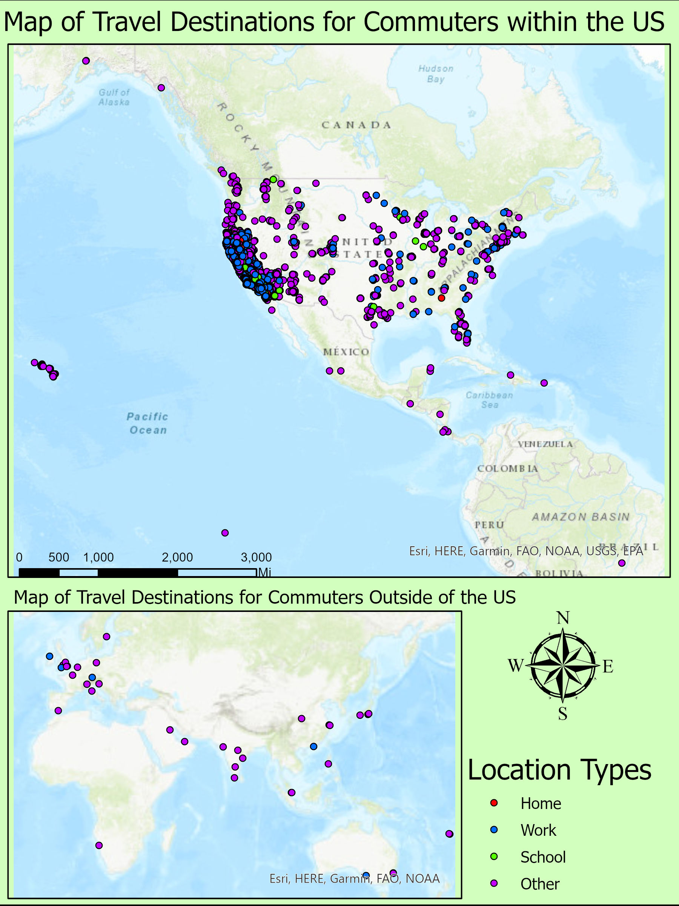

These are some projects I've done through out my time at UCSB.

# ArcMaps - Maps I created in ArcMap Pro, by ESRI

## Geog 199

{width=40%}
{width=40%}

This is from the independent studies class I took with Kostas Goulias. Here I had to go through NHTS data to create a spatial distribution of telecommuters and commuters. I did this in ArcMap, and I would have loved to revisit these maps and the data in R, however the COVID 19 pandemic cut the time I was supposed to meet and interact with my adviser:

## London Pump Analysis

{width=60%}

Here is a map I created in a class at UCSB in which we digitally replicated the Broad Street cholera outbreak, a severe outbreak of cholera that occurred in 1854 near Broad Street in the Soho district of the City of Westminster, London, England. This was an assignment to get us used to the idea of solving problems using the power of GIS. After displaying the locations and numbers of deaths due to cholera, we deduced that the number of these deaths were exceptionally higher near sewage pumps, leading to the theory that these pumps were mismanaged/poorly inspected. These same deductions were the same found by John Snow (not the GOT version) who at that time had found the same results.

## UCSB's Geog 176 Series Result

<\center>

A poster I created with a fantastic group for my Geography 176C class, the final course in a Geographic Informational Sciences series. Here we had to collect all our own data and come up with a GIS related question/theory, display, and present our findings to our peers. 

# R - Maps and Research I conducted in R
##### *some basic aesthetics were created using InkScape

## Basic Research Map

{width=50%}

This is a basic bi-variate map displaying the case and death relationships to average county income. Here anything that is more red indicates a higher average income, and low average deaths while anything more blue indicates a higher death and case count in areas that have lower average income. There are two types of income data, household income and per capita income to see if there's any variation in results. The case and death counts have also been normalized to 100,000 people, which makes areas such as LA and San Francisco (areas with high counts but due to extremely high populations)

## Flooding Analysis Start Map

Here you see the beginnings of a flooding analysis raster. For fear accidentally sharing confidential resources and out of respect for my peers, I did not want to display data that is in the process of being published and is currently being researched. This is a basic map consisting of a DEM Raster and Polylines representing the Russian River in California that is the beginning for flood prediction and analysis. 

#### ***For more work I've done in R, please visit my Labs page!***